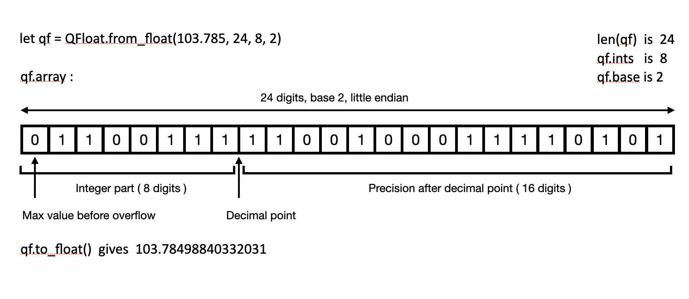

# Matrix inversion for TFHE ZAMA concrete

## Installation
```bash
poetry install
```

## Run
```bash
poetry shell
python matrix_inversion/main.py
```

## Dev

### Running tests
```bash
poetry shell
python tests/test_qfloat.py
python tests/test_qfloat_fhe.py
python matrix_inversion/qfloat_matrix_inversion.py
```

### Contributing

see TODO in `qfloat.py` and `qfloat_matrix_inversion.py` and `base_p_arrays.py`

## About

<div style="text-align: justify">

### QFloats to quantize floats in FHE
- The **QFloat** class allows to quantize float numbers as FHE compatible arrays of integers, and to make operations between them like additions, multiplications, etc.
The array can be made in any given base (for instance, in base 2 which is binary) and with any precision (the longer the array and the greater the base, the more precise the **QFloat** representation).  

- The array is split between an integer part and a decimal part (after the decimal point). For instance, 34.42 = 34 + 0.32. The length of the integer part must be provided along with the total length of the array to create a QFloat. The longer the integer part is, the higher the **QFloat** can go to encode a number, and the longer the total length is (hence the decimal part is) the more precise it can get.  

<center>
	
**Internal representation of a QFloat**

</center>



This representation allows to make any operations on the QFloats in FHE, but has a limited range of values. The usual unencrypted float representation that uses an exponent (like 3.442 e-1), cannot be made in FHE to run operations (mostly additions) without disproportionally huge computations.

- Along with the **QFloat** class, the **SignedBinary** and **Zero** classes can be used to limit the computations when we know values are binary numbers or are equal to zero. They are compatible with QFloats.

- QFloats were designed for the matrix inversion problem but can be used for (almost) any other float computations in FHE !


### Why using QFloats is required for matrix inversion
- To compute the inverse of a float matrix in FHE, one must inevitably run computations on representations of floats in FHE, with a data structure keeping a minimal precision of the initial floats which are 32 to 64 bits. Hence, a class like **QFloat** is absolutely required here, with enough precision provided.

### Why the inversion from LU decomposition was chosen
- The algorithm used for inverting the **QFloat** matrix is called **inversion from LU decomposition**. It is a perfect algorithm, not an approximate one. Approximate algorithms were investigated (ones that use convergence to estimate the inverse) but they all require constraints on the input matrix, which cannot be verified or guessed within FHE. The **LU decomposition** algorithm is perfect and works for all invertible matrices.  
Furthermore, these algorithms require a lot of matrix products which are expensive to compute, and it is not clear whether they would be faster than a perfect algorithm in FHE (provided they could be done somehow).
- For matrices of size 2x2, a simpler formula has been implemented. Unfortunately, this formula applied to larger matrices is more expensive than the inversion from LU decomposition algorithm.

### How to set QFloats for the algorithm
- QFloats are created with 3 custom parameters:
	- `qfloat_base`: The base (base 2 is binary).
	- `qfloat_len`: The total length of the integer array. The greater it is, the more precise the QFloats get.
	- `qfloat_ints`: The length of the integer part of the float. The greater it is, the higher the **QFloat** can go.
- The `qfloat_base` seems to be optimal with value 2 which corresponds to a binary encoding. Higher bases reduce the size of the QFloat encoding arrays and thus the size of the many loops in QFloats computing, but they also increase the bit width and thus slow down the computations more than the size reduction speeds it up.
- Any desired precision can be obtained if setting the QFloats with more precision (longer length), but the computation will be significantly slower.

### Further notice
- Running the computations in pure python can be useful to assess the correctness of the output, see `qfloat_matrix_inversion.py` in the test main part.
- The inversion algorithm could be optimized to be faster for the specific task of inverting matrices of floats in range ~0-100, but it was kept more general here.

### Benchmarking

The inversion algorithm has been benchmarked in both precision and speed.

#### Precision benchmarking

FHE computing is so slow that it makes the algorithm impossible to run on large matrices or with good precision parameters. However, there has been no evidence that the results are any different in FHE than in pure python for the small matrices and low precision, so we can expect that a precision benchmarking done with python is representative of the behavior in FHE.  

This benchmarking consists in running 10.000 matrix inversions ( *normal(0,100)* matrix sampler), and calculate the error in comparison to the standard `scipy.linalg` matrix inversion algorithm. For each matrix size, we computed the **mean error** over the 10.000 runs, and we also counted the percentage of results with a huge error (bigger than 1) that we can consider totally erroneous (see **big error rate**).


<center>

**Table 1: precision benchmarking**

 | Error \ Precision   | Low  | Medium  | Medium+  | High  |
 |:----------|:----------|:----------|:----------|:----------|
 | n=2 : mean error    | 8.19 e-2    |   7.6 e-3  | 7.64 e-4    | 5.03 e-4    |
 | n=2 : big error rate    | 0.04 %   | 0.02 %    | 0.01 %    | 0.0 %    |
 | n=3 : mean error     | 9.93 e-2    | 4.43 e-2    | 2.6 e-3    | 7.8 e-6    |
 | n=3 : big error rate    | 1.34 %    | 0.4 %    | 0.03 %    | 0.0 %    |
 | n=4 : mean error     | 2.04 e-1   | 2.34 e-2    | 2.778 e-1    | 8.6 e-6    |
 | n=4 : big error rate    | 3.08 %   | 0.24 %    | 0.11 %    | 0.0 %    |
 | n=5 : mean error    | 3.14 e-1    | 5.59 e-2    | 9.37 e-2    | 1.40 e-6    |
 | n=5 : big error rate    | 6.36 %    | 0.23 %    | 0.23 %    | 0.0 %    |
 | n=10 : mean error    | 1.29 e-0    | 6.87 e-1    | 2.57 e-0    | 1.2 e-4    |
 | n=10 : big error rate    | 31.3 %    | 0.44 %    | 0.75 %    | 0.0 %    |

</center>

The values of the precision parameters are listed below :

<center>

**Table 2: precision parameters**

| Precision \ Values  | Array length  | Integer digits  | True division  |
|:----------|:----------|:----------|:----------|
| Low    | 23   | 9  | False  |
| Medium |  31  | 16 | False  |
| Medium+ | 31  | 16 | True   |
| High    | 40  | 20 | True   |

</center>


After investigation of the algorithm (see function `debug_qfloat_inverse_python`), we noticed that the errors came from two different factors:
- The size of the integer part **ints**: Most of the big errors come simply from the fact that some QFloats in the matrix (lower right cells in LU decomposition) may overflow, getting values above the maximum possible value authorized by the integer `ints` part of the QFloat. By simply increasing this maximum possible value, we get less and less (eventually none) such big errors (read the table from left to right on the **big error** lines).  
- The size of the decimal part, after the decimal point: The rest of the errors come from the errors accumulating during the computations coming from the precision of decimal part. The more digits we use after the comma, the more precise the operations (additions, multiplications, divisions) get, and the less the precision error accumulate overtime. That's why in the table the errors decrease from left to right (same matrix size but more precision), but increase from top to bottom (same precision but more error accumulation with larger matrices).

Note that for **n=2** the algorithm is different than for other values of **n**, and that this results may show some statistical oddities.


#### Computation time benchmarking

To benchmark the FHE computation time (see function `time_benchmark` in `qfloat_matrix_inversion.py`), we ran 3 **compilation / encryption / run** in **low precision** on a 64 cores computing instance, we kept the times and computed the average. We repeated this for `n=2`, `n=3` and also for parameter `tensorize` set to `True` and `False` (`True` adds a bit more tensorization in the inverse algorithm than there is when set to `False`). We could not test higher sizes of matrices or higher precision due to current computational time limitations in FHE.  
Note: The benchmarking was done on `concrete-numpy 2.1.0` because the `2.2.0`and `2.3.0` did not work for compiling with `n>=3`.

<center>

**Table 3: time benchmarking**

| Computation \ n  | 2  | 2  | 3  | 3  |
|:----------|:----------|:----------|:----------|:----------|
| Tensorize    | Yes    | No    | Yes    | No    |
| Compilation    | 41   | 42 |  **4255**   |  5487  |
| FHE Run (1 run)   | 85   | 85 | 1768 | **1349** |
| Total (with encryption, 1 run)    | 126   | 127   | **6024**  | 6837 |
| Total estimated (3 runs)    | 296   | 297   | 9562  | **9537** |

</center>

We see that the algorithm used when `n=2` does not seem to change speed with or without tensorization.
However, the algorithm for `n>=3` took more time to compile **without** tensorization, but more time to run **with** tensorization. Overall, for one run (with encryption), setting `tensorize=True` was faster, but we can expect that for 3 runs or more, setting `tensorize=False` would be faster.  
Given this result, the `tensorize` parameter was given a `False` default value.

</div>
